# **🎮 FROM PLAYTIME TO PROFIT: UNLOCKING THE POWER OF PLAYER DATA 🧮**

## 🎯 OBJECTIVE

In today's competitive gaming industry, keeping players engaged while maximizing in-game purchases is crucial for a game's success.

This project simulates a real-world situation faced by a mid-sized gaming company preparing to launch a new cross-genre platform.

As a Business Analyst, I will dive deep into a gaming dataset to uncover key insights on user behavior patterns and engagement levels, identifying actionable opportunities to enhance player retention and craft smarter monetization strategies that drive business growth.

---

## 🗂️ DATASET

<sup><sub>DISCLAIMER: This fictional dataset is intended for illustrative analysis of gaming behaviors.</sup></sub>

The gaming dataset for this project has been sourced from [Kaggle](https://www.kaggle.com/datasets/rabieelkharoua/predict-online-gaming-behavior-dataset?resource=download).
It consists of two tables:
1. ```gamers_info```: Contains all the descriptive information of the gamers.

<sup><sub> Sample Data: </sup><sub>
| 🆔 PlayerID | 🎂 Age | 🚻 Gender | 🌍 Location | 🎲 Game Genre | 🎯 Game Difficulty | 📈 Engagement Level |
|:----------:|:------:|:---------:|:-----------:|:-------------:|:-----------------:|:------------------:|
| **10691**  | 23     | Male       | Europe      | RPG           | Medium             | Medium              |
| **43180**  | 44     | Male       | Asia        | Strategy      | Easy               | Low                 |
| **40053**  | 25     | Female     | Europe      | Simulation    | Easy               | Medium              |
| **17968**  | 39     | Female     | USA         | RPG           | Easy               | Medium              |
| **22088**  | 47     | Female     | Europe      | Sports        | Easy               | Low                 |


2. ```gamers_metrics```: Contains measurable usage and performance metrics of the gamers.

<sup><sub> Sample Data: </sup><sub>
| 🆔 PlayerID | ⏱️ Play Time (hrs) | 🛒 Purchases | 🎮 Sessions/Week | 🕒 Avg. Session Duration (mins) | 🧩 Player Level | 🏆 Achievements Unlocked |
|:----------:|:-----------------:|:------------:|:----------------:|:-------------------------------:|:---------------:|:-------------------------:|
| **38551**  | 6.01               | 1            | 8                | 61                              | 2               | 5                         |
| **23890**  | 22.53              | 0            | 2                | 146                             | 55              | 37                        |
| **30653**  | 19.61              | 0            | 18               | 120                             | 53              | 38                        |
| **34767**  | 16.80              | 0            | 12               | 162                             | 92              | 17                        |
| **10737**  | 21.42              | 0            | 13               | 62                              | 69              | 2                         |

---

## 🛠️ TOOLS USED
- **PostgreSQL**: Relational database tool, used to query commands
- **VSCode**: Version control software, used to execute scripts
- **ChatGPT**: AI tool, for automation and readability assistance

---

## 📚 SQL TECHNIQUES USED

#### 🧩 Basic
- ```SUM()```
- ```COUNT()```
- ```AVG()```
- ```MAX()```
- ```CAST()```
- ```MOD()```
- CASE statements

#### 🧠 Advanced
- ```JOIN```
- ```UNION```
- Subqueries
- CTEs - ```WITH()```
- Window Functions 
    - ```ROW_NUMBER() OVER()```
    - ```PERCENTILE_CONT() WITHIN GROUP()```

#### 🔍 Analytical
- ```CORR()```
- ```NTILE()```
- ```SQRT()```
- ```VARIANCE()```
- ```REGR_INTERCEPT()```
- ```REGR_SLOPE()```

---

### 🧵 Analytical Framework Used
To structure this project effectively, I’ve used the '**SQAR**' framework (Situation, Questions, Answers, Results), inspired by the popular STAR format. I will first set the stage with a hypothetical situation where this analysis is relevant, then define key business questions, answer them using efficient SQL queries, and finally present the results in a clear and actionable way.

---

## 🗺️ SITUATION

Zynkraft Games, Inc. a rapidly growing mid-sized gaming startup, has recently experienced a surge in new users and is now focusing on scaling their operations. To guide their next phase of growth, they have brought me on board — a freelance Business Analyst — to perform a deep dive into their player data. Using SQL as my primary tool, I aim to uncover critical insights that can help boost user engagement, optimize monetization strategies, and support their scaling ambitions. The findings will be presented to them in the form of a comprehensive, easy-to-understand business report.

---

## ❓QUESTIONS
To deeply understand player behavior, engagement patterns, and monetization opportunities within the game, several key questions have been explored. These questions were designed to uncover actionable insights that could help enhance player experience, improve game design, and optimize revenue strategies. Below is a breakdown of the questions tackled to guide this analysis.

---

### 🔎 Exploratory Analysis
#### 👥 Player Demographics & Profiles
1. What are the Top 10 Age Groups among players?

2. Which locations have the highest number of players?

3. What is the gender distribution among players (Male vs Female)?

4. How many players are present in each of the Top 20 Player Levels?

5. How many players fall into each Player Level quartile?


#### 🎯 Player Engagement & Activity
1. Who are the Top 25 players with the highest total playtime?

2. How many weekly sessions do players typically complete?

3. What is the average session duration by game difficulty level?

4. How engaged are players based on their average session duration?

5. What does player engagement look like across different engagement tiers (e.g., low, medium, high)?


#### 🏆 Player Behavior & Achievements
1. Which game genres are the most played?

2. What is the average playtime across different game genres?

3. What percentage of players have unlocked fewer than 10 achievements?

4. How many users play games at each difficulty level (Easy, Medium, Hard)?


#### 💰 Monetization & Purchases
1. How many players have made at least one purchase?

2. How do the number of purchases compare between USA and Asia?

3. How many purchases have been made within each game genre?


### 🧬Advanced Behavioral Analysis
1. Which genre and engagement level combinations have generated the highest number of purchases?

2. How does game genre impact playtime, engagement levels, and in-game purchase behavior?

3. Does a higher engagement level directly correlate with an increase in purchases?

4. What are the demographic profiles (age, gender, location) of players across different engagement levels?

### 🔗Deep Correlation & Relationship Analysis
1. Is there a relationship between session duration and player level progression?

2. How does player engagement, measured by average playtime, differ across genres—and how does it align with purchase behavior?

3. For each genre, how do playtime and engagement levels differ between players who have made purchases and those who haven't?

4. How does perceived game difficulty influence player engagement and long-term retention?

5. What factors drive achievement unlocking: total playtime, session frequency, or player experience level?

6. Is there a measurable relationship between achievements unlocked and key player metrics (playtime, sessions, purchases)?

7. Do player purchases or engagement levels have a stronger influence on the number of achievements unlocked?

---

## 🧩ANSWERS
I have identified some of the key questions from the above list and provided the answers below (code + outcome). For the rest of the answers, do check out the [codebook](codebook.sql).

---

### 🧠 Core User Behavior Insights (Descriptive)
#### 🏅 Which are the Top 10 Age Bands of players?
```sql
SELECT 
    age, COUNT(*) AS TOTAL_COUNT
FROM 
    gamers_info
GROUP BY 
    age
ORDER BY 
    TOTAL_COUNT DESC
LIMIT 10;
```
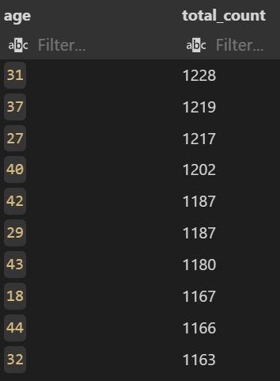

It is interesting to see that 70% of the Top 10 age groups are players in their 30s and 40s!

#### 🌍 Which locations have the highest number of players?
```sql
SELECT 
    location, 
    COUNT(*) AS TOTAL_COUNT
FROM gamers_info
GROUP BY location
ORDER BY TOTAL_COUNT DESC
LIMIT 10;
```

USA have the highest number of players followed by Europe, Asia and other nations.

#### 🎮 Which game genres are the most popular by playtime?
```sql
SELECT gamegenre, SUM(playtimehours) AS total_playtime
FROM gamers_info i
JOIN gamers_metrics m ON i.playerid = m.playerid
GROUP BY 1
ORDER BY 2 DESC
```

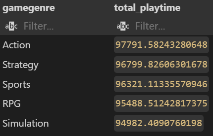

```Action``` seems to be the most played genre separated only by a small margin from ```Strategy``` and ```Sports```. RPG is an important genre for gaming but is placed 4th (this genre needs improvement), while Simulation is last.
#### 🚹🚺 What is the number of male vs female players?
```sql
SELECT
    gender,
    COUNT(*)
FROM
    gamers_info
GROUP BY 1
```

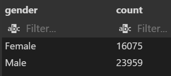
The gender ratio is 60:40 (male:female).

#### 🧗‍♂️How many players are in each quartile of Player Level progression?
```sql
SELECT 
    r.range AS player_level, 
    COUNT(*) AS total_players
FROM
    (
    SELECT 
        playerid,
    CASE 
        WHEN playerlevel >= 0 AND playerlevel < 25 THEN '25th Percentile'
        WHEN playerlevel >= 25 AND playerlevel < 50 THEN '50th percentile'
        WHEN playerlevel >= 50 AND playerlevel < 75 THEN '75th percentile'
        WHEN playerlevel >= 75 THEN '99th percentile'
    END as range
    FROM gamers_metrics) r
GROUP BY 1
ORDER BY 
    CASE
        WHEN r.range = '25th Percentile' THEN 1
        WHEN r.range = '50th Percentile' THEN 2
        WHEN r.range = '75th Percentile' THEN 3
        ELSE 4
    END, 2 DESC;
```

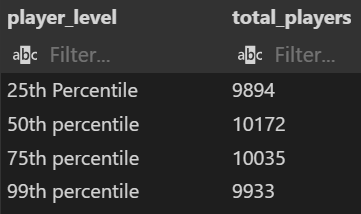
This is a healthy split of players in all 4 quartiles of Player Level, which shows the game is engaging and players see good incentive in advancing through game levels.

### 📊 Engagement & Monetization Analysis (Behavioral)
#### 🧩 What percentage of players have unlocked less than 10 achievements?
```sql
SELECT 
    CAST((SELECT COUNT(*) FROM gamers_metrics WHERE achievementsunlocked < 10) * 100 / 
        (SELECT COUNT(*) FROM gamers_metrics) AS DECIMAL(10,2)) AS low_achievements_unlocked_percentage
```

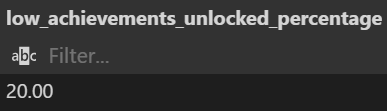
A targeted marketing campaign coupled with a well-defined incentive structure can be implemented to get these **20%** gamers to unlock more achievements. My suggestion is to show the player a glimpse of, or give a trial of a feature that they can experience if they unlock more achievements. This can be reinforced through a push notification reminding them of the achievements to be unlocked and since they are already aware of what it is like to play with that locked feature, they are more incentivised to unlock further achievements.

#### 🕒 How engaged are players in terms of average session duration across game difficulties?
```sql
SELECT r.range AS average_session_duration, COUNT(*)
FROM
    (SELECT 
        playerid,
        CASE WHEN avgsessiondurationminutes >= 10 AND avgsessiondurationminutes < 30 THEN '10 - 30'
        WHEN avgsessiondurationminutes >= 30 AND avgsessiondurationminutes < 50 THEN '30 - 50'
        WHEN avgsessiondurationminutes >= 50 AND avgsessiondurationminutes < 70 THEN '50 - 70'
        WHEN avgsessiondurationminutes >= 70 AND avgsessiondurationminutes < 90 THEN '70 - 90'
        WHEN avgsessiondurationminutes >= 90 AND avgsessiondurationminutes < 110 THEN '90 - 110'
        WHEN avgsessiondurationminutes >= 110 AND avgsessiondurationminutes < 130 THEN '110 - 130'
        WHEN avgsessiondurationminutes >= 130 AND avgsessiondurationminutes < 150 THEN '130 - 150'
        WHEN avgsessiondurationminutes >= 150 AND avgsessiondurationminutes < 170 THEN '150 - 170'
        WHEN avgsessiondurationminutes >= 170 THEN '>170'
        END AS RANGE
FROM gamers_metrics) r
GROUP BY 1 
ORDER BY 2 DESC;
```

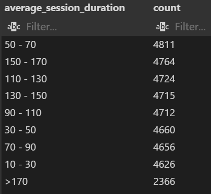
Most players have an average session of **50-70** minutes. It is interesting to note that the next three places are ocuppied by an average session duration of **110-170** minutes. It reflects a certain level of desire from players to play more (they probably lose track of time while gaming). It is safe to say that about **6%** of these gamers are our core audience since they spend over **170** minutes in a single session. We should keep a process in place to talk to these segment of users for both, receiving feedback to improve product, and also reward them with bonus points.

#### 🌎 How do purchases in the USA compare to those in Asia?
```sql
SELECT
    location,
    SUM(ingamepurchases) AS total_purchases
FROM
    gamers_info i
JOIN
    gamers_metrics m ON i.playerid = m.playerid
WHERE 
    location= 'USA' OR location= 'Asia'
GROUP BY 1
ORDER BY 2 DESC;
```

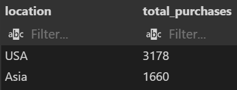
USA claim over double the in-game purchases than Asia.

---

#### 🎮⏱️💰How does game genre influence playtime, engagement level, and in-game purchases?
```sql
SELECT 
    gamegenre,
    SUM(ingamepurchases) AS total_purchases,
    CAST(PERCENTILE_CONT(0.5) WITHIN GROUP(ORDER BY playtimehours) AS DECIMAL(10,2)) AS median_playtime,
    MAX(engagementlevel) AS highest_engagement_level
FROM 
    gamers_info i
JOIN 
    gamers_metrics m ON i.playerid = m.playerid
GROUP BY 
    gamegenre
ORDER BY 2 DESC, 3 DESC;
```
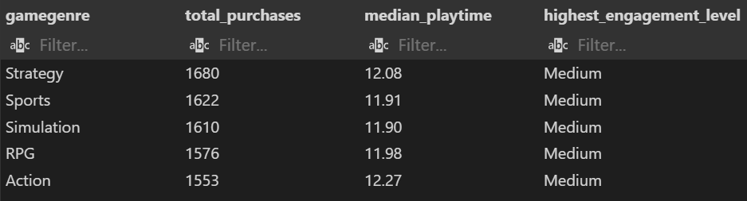
#### 📈 Key Insights:

- ```Strategy``` is the most purchased genre but ```Action``` has the highest median playtime with the least number of in-game purchases
- ```Simulation``` has the least median playtime but has more purchases than ```RPG``` and ```Action``` genres
- ```Sports``` genre has the highest count of players (from exploratory analysis) but falls short to ```Strategy``` in terms of in-game purchases
- ```RPG``` is the genre that needs to improve in terms of both playtime and in-game purchases
- Players' (who have made at least 1 in-game purchase) engagement level is uniformly 'Medium' across all genres

---

#### 🛒 Which genre and engagement level combinations have generated the highest number of purchases?
```sql
SELECT 
    gamegenre,
    engagementlevel,
    total_games,
    total_purchases
FROM 
    (
    SELECT 
    *,
    ROW_NUMBER() OVER(PARTITION BY gamegenre ORDER BY total_purchases DESC) AS rank
    FROM
        (
        SELECT 
            gamegenre,
            engagementlevel, 
            COUNT(*) AS total_games, 
            SUM(ingamepurchases) AS total_purchases
        FROM
            gamers_info i
        JOIN 
            gamers_metrics m ON i.playerid = m.playerid
        GROUP BY 1,2
        ORDER BY 1
        )
    ) purchases_rank
WHERE rank= 1
```

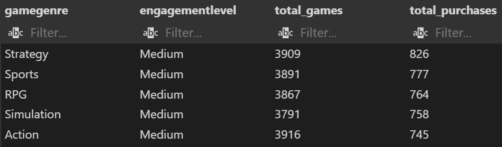

#### 📊 Key Insights:
- 'Medium' outperforms 'High' engagement level in terms of in-game purchases
- ```Strategy``` has the most in-game purchases, followed by ```Sports```, ```RPG``` and ```Simulation```, all separated by a small margin
- The ```Action``` genre, despite having the most number of games is placed last in terms of in-game purchases
- No visible evidence that engagement level combinations with genres influences in-game purchases


---

#### 🎮🛒 How does the playtime and engagement level vary with players who have made a purchase against players who haven't, for each genre?
```sql
WITH purchased_yes AS (
    SELECT 
        gamegenre,
        SUM(ingamepurchases) as total_purchases,
        CAST(AVG(playtimehours) AS DECIMAL(10,2)) AS avg_playtime,
        MAX(engagementlevel) AS highest_engagement_level
    FROM
        gamers_info i
    JOIN
        gamers_metrics m ON i.playerid = m.playerid
    WHERE
        ingamepurchases = 1
    GROUP BY 1
    ORDER BY 2 DESC
)
,
purchased_no AS (
    SELECT 
        gamegenre,
        SUM(ingamepurchases) as total_purchases,
        CAST(AVG(playtimehours) AS DECIMAL(10,2)) AS avg_playtime,
        MAX(engagementlevel) AS highest_engagement_level

    FROM
        gamers_info i
    JOIN
        gamers_metrics m ON i.playerid = m.playerid
    WHERE
        ingamepurchases = 0
    GROUP BY 1
    ORDER BY 2 DESC
)

SELECT *
FROM purchased_yes
UNION
SELECT *
FROM purchased_no
ORDER BY gamegenre, total_purchases DESC
```
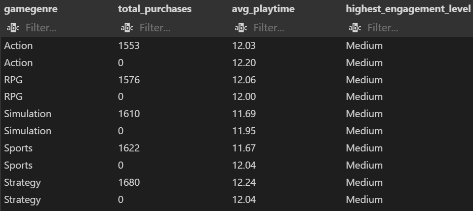

#### 📈 Key Insights
- Playtime seems to have no bearing on in-game purchases
- Players with 'Medium' engagement contribute the most to in-game purchases as well as playtime across all genres
- Players with 0 in-game purchases have more playtime in **60%** of the genres
---

### 🧠🧩 Advanced Correlation Analysis

#### 🔗 Is there any relationship between achievements unlocked and player metrics?
```sql
SELECT 
    CORR(playtimehours, achievementsunlocked) AS playtime_correlation,
    CORR(sessionsperweek, achievementsunlocked) AS session_correlation,
    CORR(playerlevel, achievementsunlocked) AS level_correlation
FROM gamers_metrics;
```
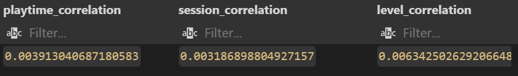

#### 🚨📖 What This Means
- No strong relationship exists between ```achievementsunlocked``` and the tested variables.

- Increasing playtime, sessions per week, or player level does not significantly increase achievements.

- Other factors might drive achievement unlocking, such as:

    - Game difficulty (e.g., easier games may lead to more achievements)

    - In-game purchases (players who spend money might unlock more)

    - Engagement level (highly engaged players might pursue achievements more)

---

#### 💬 Do purchases or engagement level drive unlocked achievements?
```sql
SELECT
    CORR(ingamepurchases, achievementsunlocked) AS purchases_correlation,
    CORR(
        CASE 
            WHEN EngagementLevel = 'Low' THEN 1
            WHEN EngagementLevel = 'Medium' THEN 2
            WHEN EngagementLevel = 'High' THEN 3
        END, AchievementsUnlocked
    ) AS engagement_correlation
FROM gamers_metrics m
JOIN gamers_info i on m.playerid = i.playerid
```
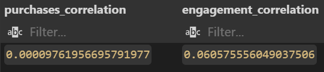

#### 🚨📖 Key Takeaways
1. In-game purchases (0.0000976) have no real effect on achievements.

    - Players spending money aren’t necessarily unlocking more achievements.

    - Achievements might be tied to skill, playtime, or game difficulty rather than purchases.

2. Engagement Level (0.0606) has a very weak impact.

    - Players with high engagement might unlock slightly more achievements, but the correlation is too small to be meaningful.

---

#### 📊 Is there a statistically significant difference in in-game purchases between two player groups?
This question demands an A/B test. So first, let's create an experiment group, categorizing the gamers into 'A' and 'B' groups, on the basis of their Player ID being odd or even. 
```sql
SELECT 
    experiment_group, 
    COUNT(*) AS num_players,
    AVG(InGamePurchases) AS avg_spending
FROM (
    SELECT 
        PlayerID, 
        InGamePurchases,
        CASE 
            WHEN MOD(PlayerID, 2) = 0 THEN 'A'
            ELSE 'B'
        END AS experiment_group
    FROM gamers_metrics
) AS ab_groups
GROUP BY experiment_group;
```

Here is an overview of the experiment group:
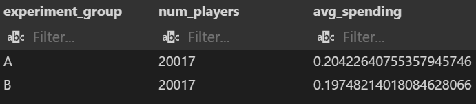

The actual group would look something like this:
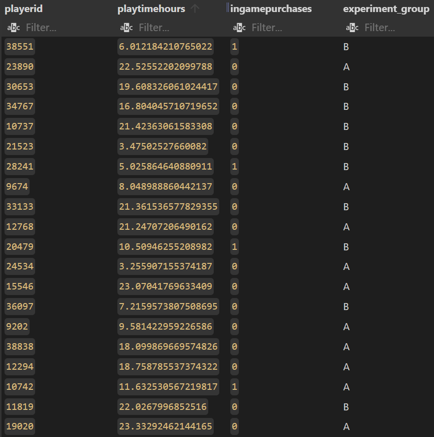

Now that we have the experiment group ready, let's dive into the A/B testing!
```sql
WITH ab_test AS (
    SELECT 
        InGamePurchases,
        CASE 
            WHEN MOD(PlayerID, 2) = 0 THEN 'A'
            ELSE 'B'
        END AS experiment_group
    FROM gamers_metrics
)
SELECT
    (AVG(CASE WHEN experiment_group = 'A' THEN InGamePurchases END) - 
     AVG(CASE WHEN experiment_group = 'B' THEN InGamePurchases END)) / 
    (SQRT(
        VARIANCE(CASE WHEN experiment_group = 'A' THEN InGamePurchases END) / 
        COUNT(CASE WHEN experiment_group = 'A' THEN 1 END) +
        VARIANCE(CASE WHEN experiment_group = 'B' THEN InGamePurchases END) / 
        COUNT(CASE WHEN experiment_group = 'B' THEN 1 END)
    )) AS t_statistic
FROM ab_test;
```

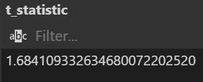


#### 📋 What does this mean?
1.684 is less than 1.96. So, the result is NOT statistically significant at the 95% confidence level.

👉 We cannot confidently say that the two groups (A and B) behave differently based on this test.

#### 🏆 How strongly do playtime, session frequency, and player level influence the number of achievements unlocked by players?
```sql
SELECT 
    REGR_INTERCEPT(achievementsunlocked, playtimehours) AS intercept,
    REGR_SLOPE(achievementsunlocked, playtimehours) AS playtime_coefficient,
    REGR_SLOPE(achievementsunlocked, sessionsperweek) AS session_coefficient,
    REGR_SLOPE(achievementsunlocked, playerlevel) AS level_coefficient
FROM gamers_metrics;
```
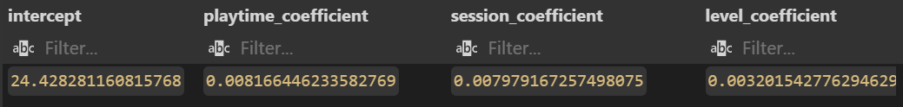

The regression analysis suggests that increases in playtime, session counts, and player level are positively associated with the predicted outcome, although their individual impacts are relatively small.

*Check out more of the regression analysis, NTILE() correlation analysis and many other questions in the [Q&A Book](q&a_book.md).*

---

## 🏁 RESULTS

In line with the project objective — uncovering actionable insights to **enhance player retention** and **drive smarter monetization** — this analysis revealed several key findings for Zynkraft to carry out their cross-genre game launch:

---

### 🎮 Player Demographics & Behavior Patterns

- **🧓👶 Age Distribution:**  
  70% of the top player base belongs to the **30s and 40s age group**, indicating a mature gaming audience who could respond well to sophisticated engagement strategies.

- **🌎 Geography:**  
  **USA** leads in player volume, followed by **Europe** and **Asia**. Marketing efforts and content localization can be prioritized accordingly.

- **🚹🚺 Gender Split:**  
  A healthy **60:40 male-to-female** ratio reflects a relatively balanced gender demographic, opening opportunities for gender-inclusive features and campaigns.

- **🎮 Popular Genres:**  
  - **Action** is the most played genre, closely followed by **Strategy** and **Sports**.  
  - **RPG** underperforms (ranked 4th) despite its market potential and needs strategic uplift.
  - **Simulation** ranks lowest in engagement, requiring a review or repositioning.

---

### 🔗 Engagement Levels & Retention Opportunities

- **📊 Player Levels:**  
  Engagement is distributed across all four player level quartiles, suggesting that the game incentivizes steady progression effectively.

- **🏆 Achievement Unlock Patterns:**  
  Around **20%** of gamers could be nudged into unlocking more achievements.  
  **💡 Recommendation:** Introduce "glimpse" or **trial unlocks** of advanced features, reinforced through personalized push notifications. This could ignite a stronger motivation loop among mid-level achievers.

- **🕒 Session Analysis:**  
  - Most players clock **50–70 minutes** per session.
  - A committed 6% of players spend **170+ minutes** in one sitting — our **core gaming audience**.
  - **💡 Recommendation:** Establish feedback loops and loyalty programs for this high-value segment to reward dedication and gather actionable feedback.

---

### 💸 Monetization Insights

- **🌍💰 Regional Purchases:**  
  USA players make **twice as many in-game purchases** compared to Asia, signaling potential for geographically tailored monetization strategies.

- **🎮🛒 Genre Purchase Behavior:**  
  - **Strategy** has the highest purchase rate despite **Action** having the highest median playtime.
  - **Simulation** players surprisingly purchase more than **RPG** and **Action** audiences despite lower playtime.
  - **RPG** lags both in playtime and purchases, indicating an urgent need for genre revitalization.

- **⏱️🛒 Engagement & Purchases:**  
  - Players with **'Medium' engagement** consistently drive the highest purchases across genres.
  - **Playtime does not significantly impact purchasing behavior** — suggesting that casual players may spend more than hardcore players.
  
  **💡 Recommendation:**  
  - Offer **starter packs** and **early-game monetization options** to casual players.
  - Introduce **progression-based purchases** (e.g., battle passes, elite rewards) to retain high-playtime users.

---

### 🧠 Deeper Behavioral Findings

- **🏆 Achievements Analysis:**  
  - In-game purchases **do not strongly influence** achievement unlocking.  
  - **Engagement level** has only a **very weak** correlation with achievements.
  - **Conclusion:** Achievements are likely driven by *skill*, *game difficulty*, or *organic progression*, not monetization.

- **👥 Player Behavior Groups:**  
  - **More playtime** → **longer session durations**, but **no significant increase** in player level or sessions per week.
  - **High-playtime players spend slightly less** than casual players, suggesting that passionate gamers grind more than they pay.
  
  **💡 Recommendation:**  
  - Implement **daily login bonuses** and **short-burst challenges** to encourage frequent re-engagement.
  - Review and possibly **rebalance the leveling system** if players plateau too early (~Level 49).

---

## 📋 SUMMARY

This analysis paints a compelling picture of a **mature, engaged, and diverse gaming community at Zynkraft**.

Our opportunity lies in:

👉 Fine-tuning monetization strategies based on player type (casual vs. hardcore),

👉 Rewarding loyalty and feedback from our core audience,

👉 Revamping underperforming genres like RPG,

👉 Designing smarter engagement strategies that align with actual player behavior — **not assumptions**.

---

## 💭 FINAL THOUGHTS
This project has:

✅ Honed my SQL querying skills by systematically addressing  the problem statement 🔥 

✅ Strengthened my ability to translate complex SQL queries into meaningful business insights 🔍

✅ Enhanced my understanding of user behavior, engagement, and monetization strategies in the gaming industry 🎯

✅ Sharpened my skills in deriving actionable recommendations from raw data 📊

✅ Reinforced the importance of connecting data findings directly to business outcomes and strategy 🚀

By continuing to deepen my technical expertise and business acumen, I am confident in driving impactful decisions and contributing to growth in the gaming and tech domains 🎮📈.

---
